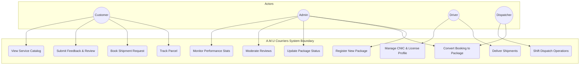
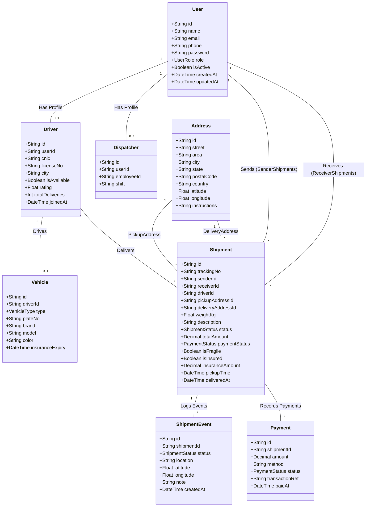
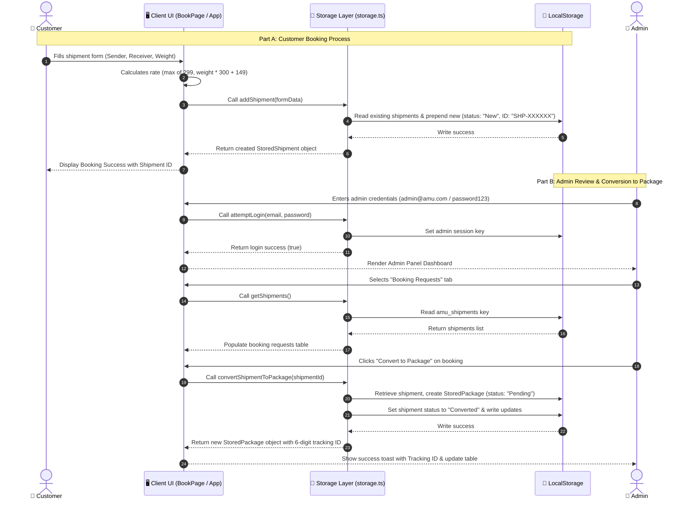
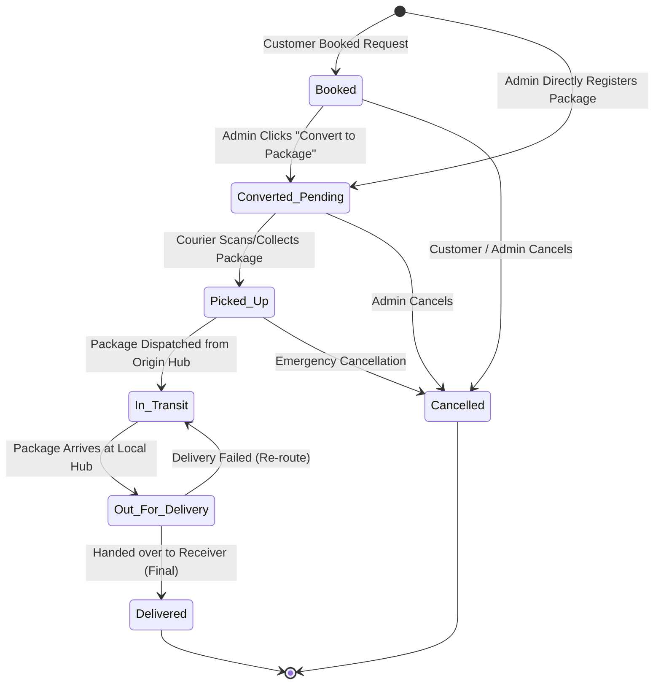
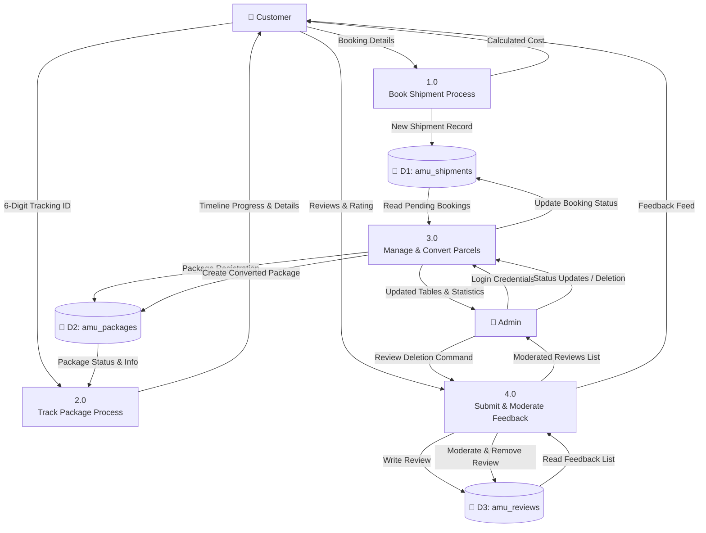
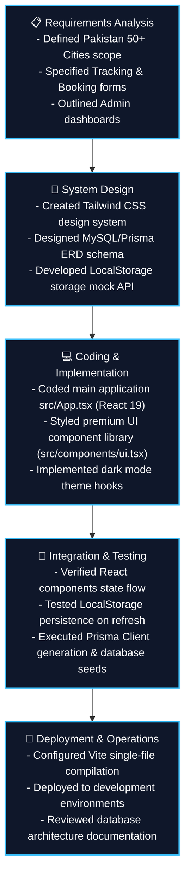
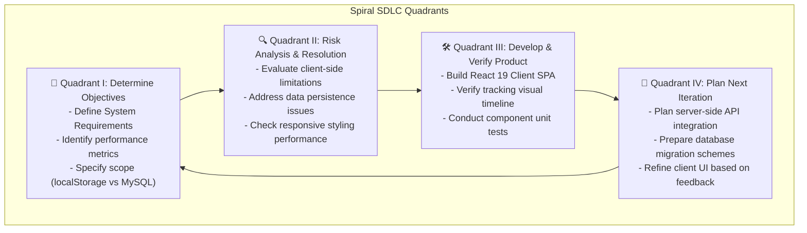
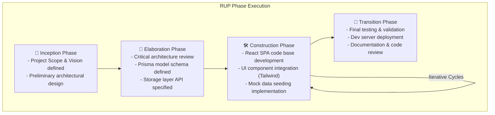

# 📊 A.M.U Courriers — Software Engineering Diagrams (BS Level)

This document contains the complete set of standard software engineering diagrams for the **A.M.U Courriers** platform. These models detail the system requirements, entities, behavioral interactions, state lifecycles, data flows, and development methodology, meeting academic expectations for a Bachelor of Science (BS) in Software Engineering.

All diagrams are rendered using standard **Mermaid** notation, making them fully viewable and editable inside standard Markdown viewers, GitHub, or VS Code.

---

## 📅 Table of Diagrams
1. [Use Case Diagram](#1-use-case-diagram)
2. [Class Diagram](#2-class-diagram)
3. [Sequence Diagram](#3-sequence-diagram)
4. [State Machine Diagram](#4-state-machine-diagram)
5. [Data Flow Diagram (DFD Level 1)](#5-data-flow-diagram-dfd-level-1)
6. [Waterfall Model Diagram](#6-waterfall-model-diagram)
7. [Spiral Model Diagram](#7-spiral-model-diagram)
8. [Scrum Process Diagram](#8-scrum-process-diagram)
9. [Rational Iteration Diagram (RUP)](#9-rational-iteration-diagram-rup)

---

## 1. Use Case Diagram
The **Use Case Diagram** defines the boundary of the A.M.U Courriers system and details how various actors (Customer, Admin, Driver, and Dispatcher) interact with different functional modules.



---

## 2. Class Diagram
The **Class Diagram** outlines the static structural design of the database schemas and local model attributes, illustrating the relationships, attributes, datatypes, and multiplicities mapped directly to the Prisma configuration.



---

## 3. Sequence Diagram
The **Sequence Diagram** models system behavior in chronological order, showing exactly how components call each other and return data when a Customer submits a booking request and an Admin converts it to a trackable shipping parcel.



---

## 4. State Machine Diagram
The **State Machine Diagram** depicts the dynamic behavior of shipments/packages, outlining all lifecycle states and the valid transitions that occur through customer booking, admin registration, and courier dispatch.



---

## 5. Data Flow Diagram (DFD Level 1)
The **DFD Level 1** diagram details the operational flow of data through processes, illustrating the interactions between external entities (Customers and Admins) and internal local datastores (`amu_packages`, `amu_shipments`, and `amu_reviews`).



---

## 6. Waterfall Model Diagram
The **Waterfall Model Diagram** outlines the linear development life-cycle stages for A.M.U Courriers, starting from requirements formulation through to final code review and system operations.



---

## 7. Spiral Model Diagram
The **Spiral Model Diagram** displays the risk-management-oriented SDLC design, showing how prototypes were continuously reviewed, analyzed, developed, and planned through four quadrants.



---

## 8. Scrum Process Diagram
The **Scrum Process Diagram** depicts the agile, sprint-based approach used to collaborate, refine features, and deliver shippable product increments.

```mermaid
graph LR
    %% Backlog elements
    PB[("📋 Product Backlog<br>- User Stories (Track, Book, Review)<br>- Technical Debt (Theme Toggle)<br>- Database Schema (Prisma)")]
    SB[("📂 Sprint Backlog<br>- Task 1: Responsive Layout<br>- Task 2: storage.ts CRUD<br>- Task 3: Admin UI components")]

    %% Process loop
    subgraph Sprint Cycle (2-4 Weeks)
        Sprint["🏃 Active Sprint<br>- Daily Scrum (15 mins)<br>- Team collaboration<br>- Peer review"]
    end

    %% Outputs
    Inc["🚀 Shippable Increment<br>- Fully functional Client SPA<br>- LocalStorage persistent DB<br>- Tested Prisma MySQL Schema"]
    
    PB -->|Sprint Planning| SB
    SB --> Sprint
    Sprint -->|Sprint Review & Retro| Inc

    %% Styling
    style PB fill:#1e293b,stroke:#06b6d4,stroke-width:2px,color:#fff
    style SB fill:#1e293b,stroke:#06b6d4,stroke-width:2px,color:#fff
    style Sprint fill:#0f172a,stroke:#06b6d4,stroke-width:3px,color:#fff
    style Inc fill:#1e293b,stroke:#10b981,stroke-width:2px,color:#fff
```

---

## 9. Rational Iteration Diagram (RUP)
The **Rational Unified Process (RUP) Iteration Diagram** breaks down the software development architecture progression structured in Inception, Elaboration, Construction, and Transition phases.


